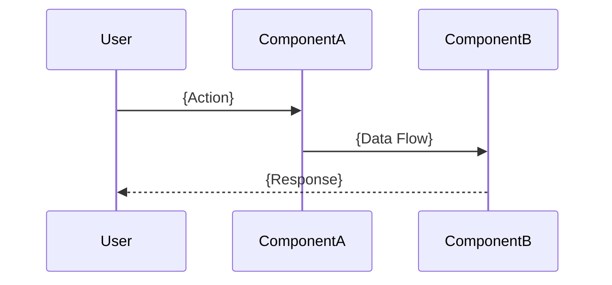

# design.md

Purpose
- High-level architecture, component interactions, and sequence diagrams. (See directives.md Section 3.2 for full rules).

## Overview
- Components:
  - {Component 1}: {Responsibility}
  - {Component 2}: {Responsibility}

## Sequence diagram (Mermaid)


# designv2.md

Purpose
- High-level architecture, component interactions, and sequence diagrams for the Spec Automation Engine. (See directives.md Section 3.2 for full rules).

Overview
- Components:
  - {Component 1: Purpose}
  - {Component 2: Purpose}
  - {Component 3: Purpose}
  - {etc.}

Sequence diagram (Mermaid)
```mermaid
sequenceDiagram
  participant User
  participant AgentComponent1
  participant AgentComponent2
  participant ArtifactStore as .spectrac/specs
  User->>AgentComponent1: Submit NL prompt
  AgentComponent1->>AgentComponent2: Parse intent & apply rules
  AgentComponent2->>ArtifactStore: Write artifacts ({scope.md}, {tasks.md}, etc.)
