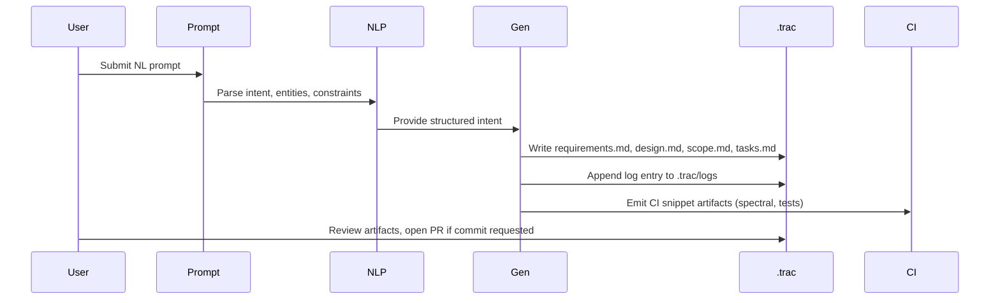

```text
# design.md

Purpose
- High-level architecture, component interactions, and sequence diagrams for the Spec Automation Engine.

Overview
- Components:
  - Prompt Interface (CLI/Chat/Web)
  - Intent Extractor / NLP
  - EARS Mapping Engine
  - Spec Template Generator (OpenAPI/JSON Schema + Markdown)
  - Artifact Writer (.trac/specs)
  - Task Planner (ID assignment, estimates)
  - Logger (.trac/logs)
  - CI Integrator (Spectral, contract checks)
  - Optional Execution UI (CLI + lightweight web UI)

Sequence diagram (Mermaid)


Data flows & persistence
- Specs are written to .trac/specs; public or distribution copies live in /specs/ (optional).
- Logs are append-only structured text in .trac/logs with ISO8601 timestamps.

Idempotency & update rules
- Agents must detect if the same prompt has been processed; if re-run, produce a new revision (increment version) or create a Decision Point for manual merge.
- Edits to existing requirements must include a diff paragraph in the session log indicating the previous value and changed lines.

Security & privacy
- Do not include secrets or PII inside artifacts or logs. Redact or mark with `<REDACTED>`.

Open items (Decision Points)
- D-001: Project manifest values (project name, commit policy).
- D-002: Preferred generator languages for client SDKs.
```
